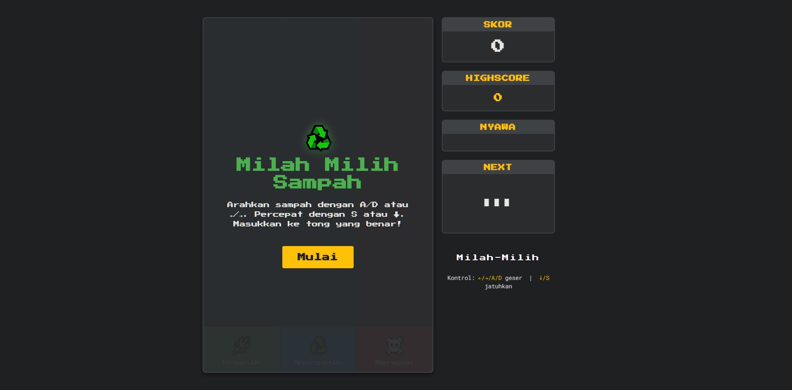

# Milah-Milih Sampah

## Screenshots

<div style="display: flex; gap: 10px;">
  
  
</div>

## Demo
You can play the game online at [Milah-Milih Sampah Demo](https://mukafug.github.io/Milah-Milih-WebGame/).

## Overview
Milah-Milih Sampah is an interactive web-based game designed to educate users about waste segregation. Players must sort waste into the correct bins (Organic, Inorganic, and Hazardous) using keyboard controls.

## Features
- **Interactive Gameplay**: Use keyboard controls to sort waste items.
- **Educational**: Learn about different types of waste and their proper disposal.
- **Highscore Tracking**: Compete with yourself to achieve the highest score.
- **Sound Effects**: Enjoy engaging sound effects for correct and incorrect actions.

## How to Play
1. Use `A/D` or `←/→` keys to move the waste left or right.
2. Use `S` or `↓` keys to speed up the waste drop.
3. Drop the waste into the correct bin:
   - 🌿 Organic
   - ♻️ Inorganic
   - ☠️ Hazardous
4. Avoid mistakes to keep your lives intact.

## Controls
- **Move Left**: `A` or `←`
- **Move Right**: `D` or `→`
- **Speed Up Drop**: `S` or `↓`

## Installation
1. Clone the repository:
   ```bash
   git clone https://github.com/mukafug/Milah-Milih-WebGame.git
   ```
2. Navigate to the project directory:
   ```bash
   cd Milah-Milih-WebGame
   ```
3. Open `index.html` in your browser to start the game.
